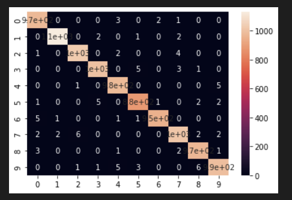
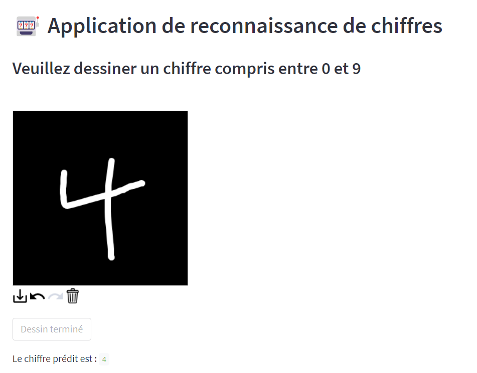
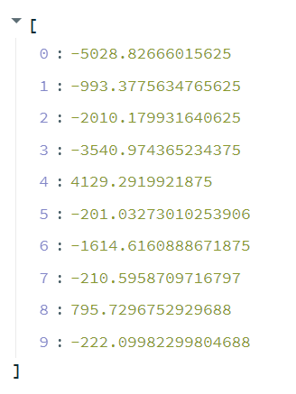
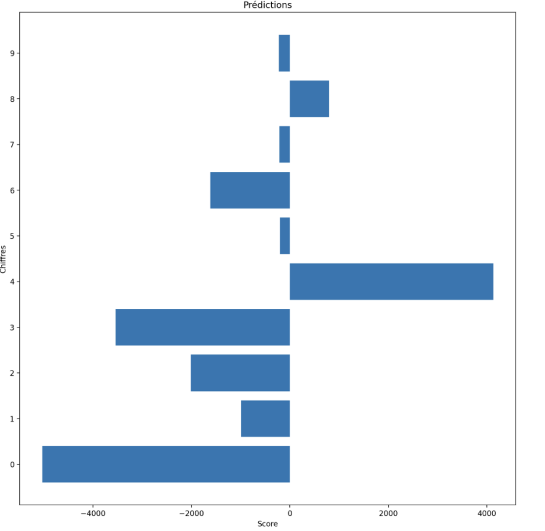

# Classification des chiffres  

## Documents relatifs à ce projet
Pour ce projet, il est nécessaire de télécharger le dataset disponible à [l'adresse suivante](https://github.com/teavanist/MNIST-JPG).  
Dans ce repository, vous trouverez comme documents : 
- un jupyter notebook `notebook_reco_chiffres.ipynb`
- un fichier python permettant de lancer l'application Streamlit `reco_chiffres.py`
- le modèle CNN sauvegardé : `cnn_essai`, avec comme sous-fichiers:
  - `saved_model.pb`
  - `keras_metadata.pb`
  - `variables.index`
  - `variables.data-00000-of-00001`
- plusieurs images de test créees grâce à [Microsoft Paint](https://support.microsoft.com/fr-fr/windows/obtenir-microsoft-paint-a6b9578c-ed1c-5b09-0699-4ed8115f9aa9) au format 28px*28px (et mises ici dans le dossier test):
  - `test.png`
  - `test2.png`
  - `test3.png`
  - `test4.png`
  - `test5.png`

## Jupyter Notebook
Le jupyter notebook comprend plusieurs étapes.  
Tout d'abord il y a l'importation des différentes bibliothèques que nous allons utiliser.  
Puis il y a le chargement des données de train et de test grâce à des *boucles for*.  
Ensuite, une fois les données collectées, il y a le développement de l'architecture du CNN. 
Le développement de cette architecture se termine par la visualisation de *l'accuracy*, de la *val-accuracy* et de la *loss* du modèle au cours de différentes *epochs*.  
Après cela, il y a une visualisation graphique de *l'accuracy* du modèle ainsi que la mise en place d'une matrice de confusion.  
    
Pour enregistrer ce modèle de CNN on utilise la fonction `model.save` de TensorFlow. Ici le modèle est enregistré sous le nom `cnn_essai`.  
Enfin, il y a deux fonctions qui permettent d'utiliser notre modèle :
  - `reco_1()` qui permet de visualiser une seule image d'un dossier avec sa prédiction.  
  
  - `reco_2()` qui permet de visualiser toutes les images d'un dossier avec leur prédiction.  
 

## Application Streamlit
En complément du jupyter notebook, nous avons crée une application Streamlit qui permet, lorsqu'on dessine un chiffre, de prédire duquel il s'agit. 
L'interface permet, en plus du dessin et de sa prédiction, d'avoir les résultats du modèle concernant l'ensemble des chiffres de 0 à 9.   
Cette application a été déployée [ici](https://share.streamlit.io/paulinesanchez/classification_des_chiffres/main/app_reco.py) sur la plateforme de Streamlit.  
  
  
  
